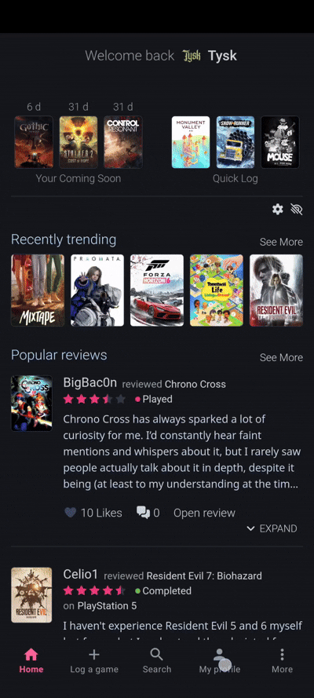
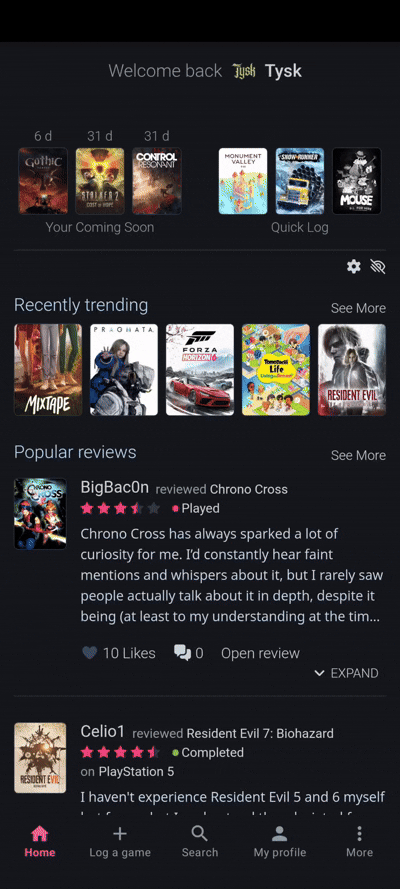
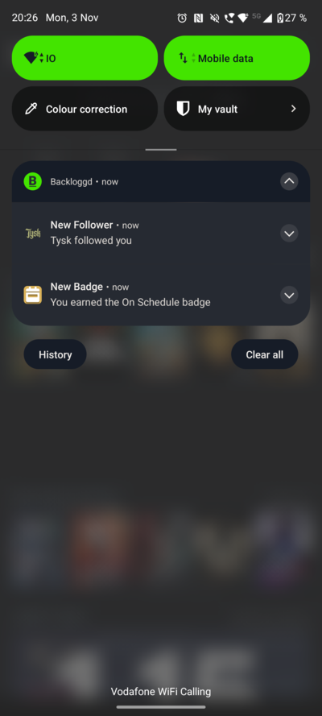

# Backloggd Android App

 
This is an Android application for the website [backloggd.com](https://backloggd.com). It provides a native-feeling experience with its own navigation, improved UI/UX, and integrated Android features.

[**Download latest version here**](https://github.com/wagenknecht/Backloggd-Android-App/releases/latest/download/backloggd.apk)

## Features

- **Native Navigation:** Bottom navigation bar for quick access to Home, Log a Game, Search, and Profile.
- **Side Drawer:** Easy access to Notifications, Library, Activity, and Settings.
- **Push Notifications:** Stay updated with native Android notifications.
- **Fullscreen Experience:** Immersive viewing of Backloggd without browser UI clutter.
- **Smart Logic:** Automatic username detection for personalized navigation.
- **Launcher Support:** Full adaptive icon support for a consistent Android look.
- **Optimized:** Small install size through code and resource optimization.
- **Native UX:** Pull-to-refresh support and a loading progress bar for a seamless experience.

## Demonstration

### Navigation Bar

### Side Drawer

### Native Android Notifications

### Quick Log & Search

To install the app, download the latest APK from the [releases page](https://github.com/wagenknecht/Backloggd-Android-App/releases) and install it on your Android device.

## Usage

1. Open the app.
2. Enjoy the fullscreen experience of Backloggd.

## Star History

<a href="https://www.star-history.com/#wagenknecht/Backloggd-Android-App&type=date&legend=top-left">
 <picture>
   <source media="(prefers-color-scheme: dark)" srcset="https://api.star-history.com/svg?repos=wagenknecht/Backloggd-Android-App&type=date&theme=dark&legend=top-left" />
   <source media="(prefers-color-scheme: light)" srcset="https://api.star-history.com/svg?repos=wagenknecht/Backloggd-Android-App&type=date&legend=top-left" />
   
 </picture>
</a>

## Contributing

Contributions are welcome! Please feel free to submit a Pull Request.

## Contact

For any questions or suggestions, please open an issue.

